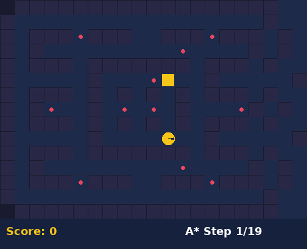
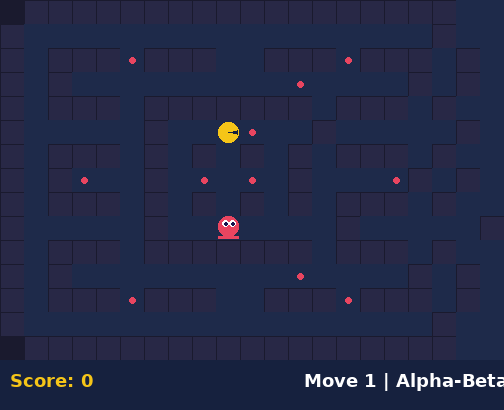
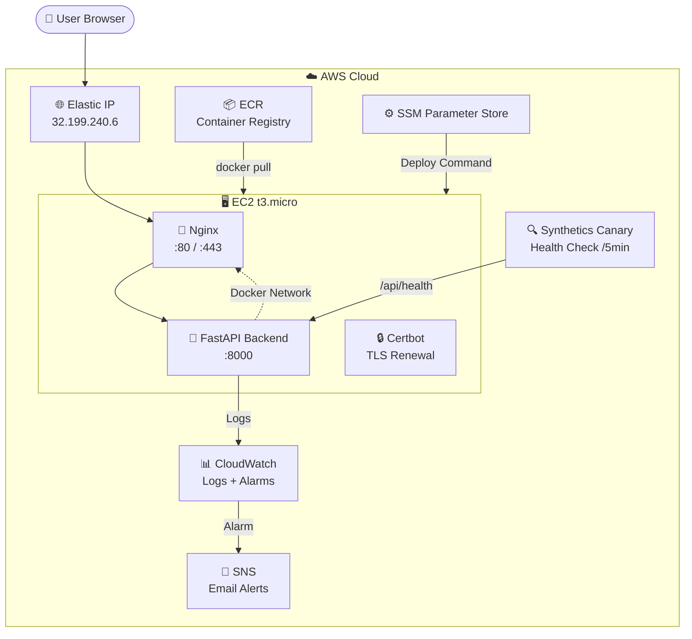

<h1 align="center">🎮 Pacman AI — Production Deployment on AWS</h1>

<p align="center">
  <em>A web-based Pacman AI demo showcasing A* search and Alpha-Beta pruning,<br>
  deployed with production-grade CI/CD on AWS using Terraform, ECR, and GitHub Actions.</em>
</p>

<p align="center">
  <a href="http://32.199.240.6:8000">
    
  </a>
  <a href="https://github.com/shkroyas/Pacman-Game/actions">
    
  </a>
  <a href="docs/cost-estimate.md">
    
  </a>
</p>

---

## 📺 Demo

<div align="center">



*AI agents solving Pacman mazes using A\* search and Alpha-Beta pruning*

</div>

### 🎥 Videos

| Demo | Description |
|------|-------------|
| [](docs/pacman_ai_demo.mp4) | **A\* Search** — Optimal pathfinding with Manhattan heuristic |
| [](docs/pacman_ai_demo.mp4) | **Alpha-Beta** — Adversarial game-tree search vs ghosts |

[▶️ Watch full demo video](docs/pacman_ai_demo.mp4)

---

## 🏗️ Architecture



### Component Overview

| Component | Purpose | Technology |
|-----------|---------|------------|
| **Frontend** | Interactive maze visualization | HTML5 Canvas, JavaScript |
| **Backend** | AI algorithms + REST API | Python 3.11, FastAPI, Uvicorn |
| **Reverse Proxy** | TLS termination, compression | Nginx (sidecar container) |
| **Container Registry** | Docker image storage | Amazon ECR |
| **Infrastructure** | All AWS resources | Terraform (IaC) |
| **CI/CD** | Automated build + deploy | GitHub Actions → ECR → SSM |
| **Monitoring** | Logs, metrics, health checks | CloudWatch, Synthetics |

---

## 🔄 CI/CD Pipeline

```
┌─────────────────────────────────────────────────────────────┐
│                    git push origin main                      │
└──────────────────────────┬──────────────────────────────────┘
                           │
                           ▼
┌─────────────────────────────────────────────────────────────┐
│  🧪 TEST                                                    │
│  ┌─────────────┐  ┌─────────────┐                           │
│  │  pytest      │  │  flake8     │                           │
│  │  (8 tests)   │  │  (lint)     │                           │
│  └──────┬──────┘  └──────┬──────┘                           │
│         └───────┬────────┘                                  │
│                 ▼                                            │
│  ✅ All tests pass                                           │
└──────────────────────────┬──────────────────────────────────┘
                           │
                           ▼
┌─────────────────────────────────────────────────────────────┐
│  🐳 BUILD & PUSH TO ECR                                     │
│  ┌──────────────┐  ┌──────────────┐  ┌──────────────┐      │
│  │ docker build  │→ │ docker tag    │→ │ docker push   │      │
│  │ :${SHA}       │  │ :${SHA}       │  │ to ECR        │      │
│  └──────────────┘  └──────────────┘  └──────────────┘      │
│  Image: 211125530162.dkr.ecr.us-east-1.amazonaws.com/      │
│         pacman-game:${GIT_SHA}                              │
└──────────────────────────┬──────────────────────────────────┘
                           │
                           ▼
┌─────────────────────────────────────────────────────────────┐
│  🚀 DEPLOY TO EC2                                           │
│  ┌────────────────────────────────────────────────────┐     │
│  │  SSM Run Command → EC2                              │     │
│  │                                                      │     │
│  │  1. curl deploy.sh from GitHub                       │     │
│  │  2. docker pull ${ECR}:${SHA}                        │     │
│  │  3. docker stop old container                        │     │
│  │  4. docker run new container                         │     │
│  │  5. curl /api/health (10 retries)                    │     │
│  │  6. ✅ Health check passed → update SSM param         │     │
│  │     ❌ Health check failed → rollback to last good    │     │
│  └────────────────────────────────────────────────────┘     │
└──────────────────────────┬──────────────────────────────────┘
                           │
                           ▼
┌─────────────────────────────────────────────────────────────┐
│  ✅ LIVE at http://32.199.240.6:8000                         │
└─────────────────────────────────────────────────────────────┘
```

---

## 🧠 AI Algorithms

### A* Search — Intelligent Pathfinding

Finds the shortest path using heuristics to guide the search.

```
Brute Force:  Check ALL paths     → O(b^d) operations
A* Search:    Check SMART paths   → O(b^(d/2)) operations
```

| Algorithm | Description | Heuristic |
|-----------|-------------|-----------|
| **Q1a** | Single dot search | Manhattan distance |
| **Q1b** | Multi-dot search | Minimum food distance |
| **Q1c** | Full board clear | Food count remaining |

### Alpha-Beta Pruning — Adversarial Decision Making

Makes optimal decisions against ghost opponents by pruning impossible branches.

```
Minimax:    Explore ALL branches  → 1,000,000 nodes
Alpha-Beta: Skip IMPOSSIBLE ones → 100,000 nodes
```

| Feature | Implementation |
|---------|---------------|
| Search depth | Configurable (1-5) |
| Evaluation | Score + food distance + ghost proximity |
| Pruning | Alpha-beta with move ordering |

---

## 🚀 Deployment Guide

### Prerequisites

| Requirement | Check |
|-------------|-------|
| AWS CLI configured | `aws sts get-caller-identity` |
| Terraform installed | `terraform version` |
| Docker installed | `docker --version` |
| GitHub repo secrets | `AWS_KEY_ACCESS_ID`, `AWS_SECRET_ACCESS_KEY` |

### Step-by-Step Deployment

#### 1️⃣ Clone & Configure

```bash
git clone https://github.com/shkroyas/Pacman-Game.git
cd Pacman-Game
```

#### 2️⃣ Set Up Terraform Backend

```bash
# Create S3 bucket for state
aws s3 mb s3://pacman-tf-state-211125530162 --region us-east-1

# Create DynamoDB table for locking
aws dynamodb create-table \
  --table-name terraform-locks \
  --attribute-definitions AttributeName=LockID,AttributeType=S \
  --key-schema AttributeName=LockID,KeyType=HASH \
  --billing-mode PAY_PER_REQUEST \
  --region us-east-1
```

#### 3️⃣ Deploy Infrastructure

```bash
cd terraform/
terraform init
terraform plan
terraform apply
```

#### 4️⃣ Push First Image to ECR

```bash
# Login to ECR
aws ecr get-login-password --region us-east-1 | \
  docker login --username AWS --password-stdin 211125530162.dkr.ecr.us-east-1.amazonaws.com

# Build and push
docker build -t pacman-game:latest .
docker tag pacman-game:latest 211125530162.dkr.ecr.us-east-1.amazonaws.com/pacman-game:latest
docker push 211125530162.dkr.ecr.us-east-1.amazonaws.com/pacman-game:latest
```

#### 5️⃣ Configure GitHub Secrets

Go to `https://github.com/shkroyas/Pacman-Game/settings/secrets/actions`:

| Secret Name | Value |
|-------------|-------|
| `AWS_KEY_ACCESS_ID` | Your IAM access key |
| `AWS_SECRET_ACCESS_KEY` | Your IAM secret key |

#### 6️⃣ Push to Trigger Pipeline

```bash
git add .
git commit -m "feat: deploy to production"
git push origin main
```

**That's it!** The pipeline automatically:
1. Runs tests
2. Builds Docker image
3. Pushes to ECR
4. Deploys to EC2 via SSM

---

## 📊 Monitoring & Observability

### CloudWatch Dashboard

| Metric | Source | Alert |
|--------|--------|-------|
| Application logs | `/pacman-game/application` | Log metric filter |
| CPU utilization | EC2 metrics | >80% for 5 min → email |
| Health check failures | Synthetics Canary | Every 5 min |
| Deploy events | SSM Command history | On failure → rollback |

### Manual Health Check

```bash
# Check app health
curl http://32.199.240.6:8000/api/health

# Expected response:
{"status":"healthy","version":"1.0.0"}
```

### Viewing Logs

```bash
# Via CloudWatch Logs
aws logs tail /pacman-game/application --follow

# Via SSM (SSH-free)
aws ssm send-command \
  --document-name "AWS-RunShellScript" \
  --targets "Key=tag:Name,Values=pacman-ai-server" \
  --parameters "commands=['docker logs pacman-backend --tail 50']"
```

---

## 💰 Cost Breakdown

| Resource | Free Tier | After 12 Months |
|----------|-----------|-----------------|
| EC2 t3.micro | $0 | ~$8.50/mo |
| EBS 20GB | $0 | ~$1.60/mo |
| ECR | $0 | ~$0.10/mo |
| CloudWatch | $0 | ~$2-3/mo |
| SNS + SSM | $0 | ~$0.50/mo |
| **Total** | **~$0/mo** | **~$12-15/mo** |

> **Cost optimization**: Nginx sidecar saves ~$16-18/mo vs Application Load Balancer

See [full cost analysis →](docs/cost-estimate.md)

---

## 📁 Project Structure

```
pacman-game/
├── backend/main.py              # FastAPI application
├── frontend/                    # HTML5 Canvas UI
├── agents/                      # AI agent implementations
│   ├── q2Agent.py              # Alpha-Beta pruning agent
│   └── pacmanAgents.py         # Simple agent
├── solvers/                     # A* search implementations
│   ├── q1a_solver.py           # Single dot A*
│   ├── q1b_solver.py           # Multi-dot A*
│   └── q1c_solver.py           # Full clear A*
├── problems/                    # Problem definitions
├── tests/                       # Unit tests (8 tests)
├── layouts/                     # Maze layout files
├── terraform/                   # Infrastructure as Code
│   ├── main.tf                 # Provider & S3 backend
│   ├── ec2.tf                  # EC2 + Elastic IP
│   ├── ecr.tf                  # Container registry
│   ├── iam.tf                  # Instance role (SSM, ECR, CW)
│   ├── cloudwatch.tf           # Logs, alarms, canary
│   ├── ssm.tf                  # Parameter Store
│   └── security_groups.tf      # Firewall rules
├── nginx/nginx.conf             # Reverse proxy config
├── scripts/
│   ├── deploy.sh               # Auto-deploy + rollback
│   └── bootstrap.sh            # EC2 first-boot setup
├── .github/workflows/deploy.yml # CI/CD pipeline
├── docker-compose.yml           # Nginx + Backend + Certbot
├── Dockerfile                   # Python 3.11 slim
└── requirements.txt             # Python dependencies
```

---

## 🔧 API Endpoints

| Endpoint | Method | Description |
|----------|--------|-------------|
| `/` | GET | Web UI |
| `/api/layouts` | GET | List maze layouts |
| `/api/solve` | POST | Solve maze with A* |
| `/api/play` | POST | Play game with Alpha-Beta |
| `/api/health` | GET | Health check |

---

## 🛡️ Security

- **No inbound SSH** — All management via SSM Run Command
- **Backend not exposed** — Only reachable from Nginx on Docker network
- **TLS termination** — Nginx handles HTTPS (once configured)
- **Secrets in SSM** — No hardcoded credentials
- **ECR lifecycle** — Untagged images auto-deleted after 7 days

---

## 📚 Documentation

| Document | Description |
|----------|-------------|
| [Architecture](docs/architecture.md) | System design decisions |
| [Cost Estimate](docs/cost-estimate.md) | Monthly cost breakdown |
| [Recovery Runbook](docs/recovery-runbook.md) | Incident response guide |
| [Deployment Guide](DEPLOYMENT.md) | Step-by-step deployment |

---

## 🧪 Running Tests

```bash
# Install dependencies
pip install -r requirements.txt
pip install pytest

# Run all tests
python -m pytest tests/ -v

# Run with coverage
python -m pytest tests/ -v --tb=short
```

---

## 📄 License

MIT License — see [LICENSE](LICENSE)

---

<p align="center">
  <sub>Built with ❤️ using Python, FastAPI, Docker, Terraform, and GitHub Actions</sub>
</p>
