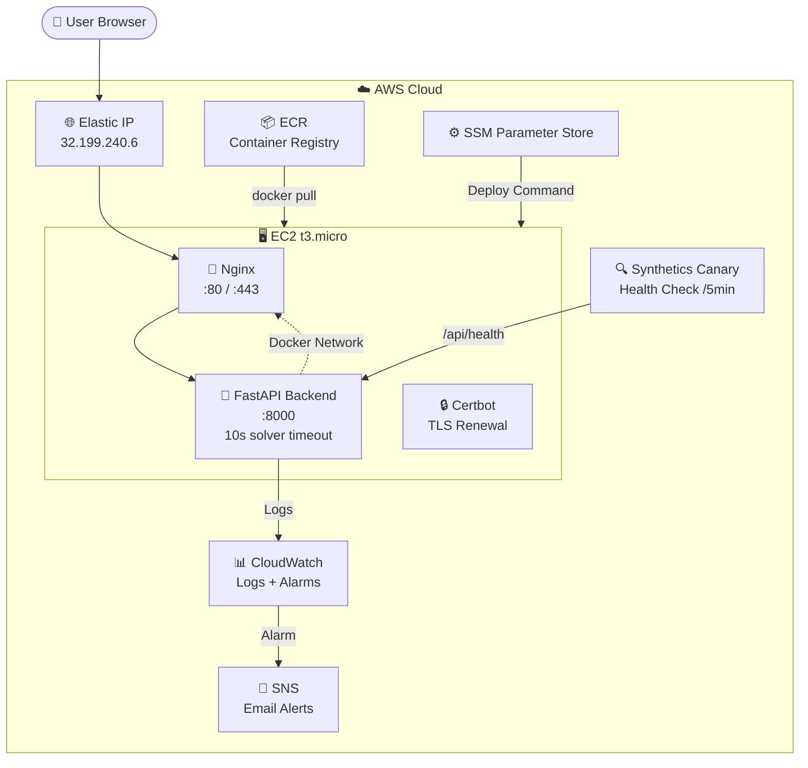

<h1 align="center">🎮 Pacman AI — Production Deployment on AWS</h1>

<p align="center">
  <em>A web-based Pacman AI demo showcasing A* search and Alpha-Beta pruning,<br>
  deployed with production-grade CI/CD on AWS using Terraform, ECR, and GitHub Actions.</em>
</p>

<p align="center">
  <a href="http://32.199.240.6:8000">
    
  </a>
  <a href="https://github.com/shkroyas/Pacman-Game/actions">
    
  </a>
  <a href="docs/cost-estimate.md">
    
  </a>
</p>

---

## 📺 Demo

<div align="center">


*AI agents solving Pacman mazes using A\* search and Alpha-Beta pruning*

</div>

### 🎥 Videos

| Demo | Description |
|------|-------------|
| [](docs/pacman_ai_demo.mp4) | **A\* Search** — Optimal pathfinding with Manhattan heuristic |
| [](docs/pacman_ai_demo.mp4) | **Alpha-Beta** — Adversarial game-tree search vs ghosts |

[▶️ Watch full demo video](docs/pacman_ai_demo.mp4)

---

## 🎮 How to Play

### Quick Start

1. **Open the app**: [http://32.199.240.6:8000](http://32.199.240.6:8000)
2. **Select a maze layout** from the dropdown
3. **Choose an algorithm** (A* Single, Multi, or Full Clear)
4. **Set search depth** (2-3 recommended for best balance)
5. **Click "Solve Maze"** to watch pathfinding, or **"Play Game"** for a full game with ghosts

### Controls

| Control | Description |
|---------|-------------|
| **Layout dropdown** | Choose which maze to solve (loaded dynamically from API) |
| **Algorithm dropdown** | Select the AI algorithm |
| **Search Depth** | How deep the AI searches (1-5, higher = smarter but slower) |
| **Solve Maze** | Watch the AI find the optimal path to the nearest dot |
| **Play Game** | Watch a full game with ghosts, capsules, and scoring |
| **Reset** | Clear the canvas and start over |

### Game Elements

```
🟡 Yellow circle  = Pacman (the AI agent)
🔴 Red dots       = Food (collect these to score +10 points each)
🔵 Blue circles   = Power capsules (eat to score +50 and scare ghosts for 40 moves)
🟥 Red ghosts     = Enemies (avoid unless scared — touching them ends the game)
⬛ Dark walls     = Maze walls (cannot pass through)
🟦 Blue floor     = Walkable paths
```

### Game Rules

- **Eat food** to score points (+10 per dot)
- **Eat power capsules** to scare ghosts (+50 points, ghosts flee for 40 moves)
- **Eat scared ghosts** for bonus points (+200 each)
- **Avoid active ghosts** — touching one ends the game
- **Clear all food** to win the level

---

## 🧠 Algorithm Deep Dive

### 1. A* Search — Single Dot (`astar`)

**What it does:** Finds the shortest path from Pacman to the nearest food dot.

**How it works:**
```
f(n) = g(n) + h(n)

where:
  g(n) = actual cost from start to current position
  h(n) = heuristic estimate from current position to goal (Manhattan distance)
```

**Example — Tiny Maze:**
```
Start: Pacman at (1,1)
Goal:  Nearest dot at (3,3)

A* explores positions in order of f(n):
  → (1,1): f = 0 + 4 = 4
  → (2,1): f = 1 + 3 = 4
  → (1,2): f = 1 + 3 = 4
  → (2,2): f = 2 + 2 = 4
  → (3,2): f = 3 + 1 = 4
  → (3,3): f = 4 + 0 = 4  ✅ Found!

Result: Path East → East → North → North (4 moves)
```

**When to use:** Simple mazes without ghosts, when you want the shortest path to a single target.

**What you'll see:** Pacman moves directly to the nearest dot, taking the optimal path. The yellow trail shows all positions the AI considered.

---

### 2. A* Search — Multi-Dot (`astar_multi`)

**What it does:** Plans a path that visits ALL food dots in the maze.

**How it works:**
```
Heuristic: Minimum distance to any uneaten food dot

At each position, the AI asks:
  "What's the closest food I haven't eaten yet?"
  → Use that distance as the heuristic
  → This guides the search toward collecting all dots efficiently
```

**Example — Medium Corners:**
```
Food positions: (1,1), (1,5), (5,1), (5,5)
Pacman starts at (3,3)

A* Multi plans a route that collects all dots:
  → (3,3) → (1,1) → (1,5) → (5,5) → (5,1)

Total moves: 12 (optimal for this layout)
```

**When to use:** Mazes with multiple dots where you want to collect everything.

**What you'll see:** Pacman moves from dot to dot, collecting them all. The path shows the complete route through the maze.

---

### 3. A* Search — Full Clear (`astar_full`)

**What it does:** Finds a path that eats every single dot in the maze.

**How it works:**
```
Uses food-count heuristic:
  h(n) = number of remaining food dots

The AI considers:
  1. Current position
  2. How many dots are left
  3. Which dot to eat next

This is the most complete (but slowest) A* variant.
```

**When to use:** When you want to guarantee every dot is collected.

**What you'll see:** Pacman systematically clears the entire maze, visiting every corner.

---

### 4. Alpha-Beta Pruning (`alpha_beta`)

**What it does:** Plays a full game against ghost opponents using game-tree search.

**How it works:**
```
                    Pacman's Turn
                   /      |      \
              Move1     Move2     Move3
                /         |         \
          Ghost1        Ghost1      Ghost1
          / | \         / | \       / | \
        G1  G2  G3   G1  G2  G3  G1  G2  G3
        ... (continue to depth N)

Alpha-Beta PRUNES branches that can't affect the final decision:
  ✂️ Cut branches where Ghost's best move already makes Pacman worse
  → Reduces search from 1,000,000 nodes to ~100,000
```

**Evaluation Function:**
```
score = (current_score × 1.0)
      + (food_proximity_bonus)
      - (ghost_danger_penalty if ghost is close and active)
      + (ghost_hunting_bonus if ghost is scared)
      - (remaining_food_penalty)
```

**Ghost Behavior:**
- **Active ghosts**: Chase Pacman (80% chance take closest action)
- **Scared ghosts**: Flee from Pacman (80% chance take farthest action)
- **Scared duration**: 40 moves after capsule pickup

**Example — Q2 Classic:**
```
Layout: Medium maze with 2 ghosts

Depth 1: Pacman looks 1 move ahead
  → Simple dodging, may miss food

Depth 2: Pacman looks 2 moves ahead
  → Better path planning, avoids traps

Depth 3: Pacman looks 3 moves ahead
  → Strategic play, sets up ghost traps
```

**When to use:** Full games with ghost opponents.

**What you'll see:**
- Pacman navigates around ghosts
- Eats food while avoiding danger
- Uses power capsules to scare ghosts (they flee for 40 moves!)
- Game ends if a ghost catches Pacman

---

### Algorithm Comparison

| Algorithm | Speed | Intelligence | Use Case |
|-----------|-------|-------------|----------|
| A* Single | ⚡ Fast | Pathfinding | Simple maze, one target |
| A* Multi | ⚡ Fast | Route planning | Collect all dots |
| A* Full | 🐢 Slowest | Complete clearing | Visit every dot |
| Alpha-Beta | ⚡-🐢 Depends on depth | Strategic play | Full game vs ghosts |

### Search Depth Effect

| Depth | Nodes Expanded | Intelligence | Speed |
|-------|---------------|-------------|-------|
| 1 | ~10 | Basic | ⚡⚡⚡ |
| 2 | ~50 | Good | ⚡⚡ |
| 3 | ~200 | Smart | ⚡ |
| 4 | ~1,000 | Very smart | 🐢 |
| 5 | ~5,000+ | Expert | 🐢🐢 |

**Recommendation:** Start with depth 2-3 for a good balance of speed and intelligence.

---

### Scoring System

| Action | Points |
|--------|--------|
| Eat food dot | +10 |
| Eat power capsule | +50 |
| Eat scared ghost | +200 |
| Complete level (all food eaten) | Win |
| Each move | -1 (time penalty) |
| Eaten by ghost | Game Over |

---

## 🏗️ Architecture



### Component Overview

| Component | Purpose | Technology |
|-----------|---------|------------|
| **Frontend** | Interactive maze visualization | HTML5 Canvas, JavaScript |
| **Backend** | AI algorithms + REST API | Python 3.11, FastAPI, Uvicorn |
| **Reverse Proxy** | TLS termination, compression | Nginx (sidecar container) |
| **Container Registry** | Docker image storage | Amazon ECR |
| **Infrastructure** | All AWS resources | Terraform (IaC) |
| **CI/CD** | Automated build + deploy | GitHub Actions → ECR → SSM |
| **Monitoring** | Logs, metrics, health checks | CloudWatch, Synthetics |

---

## 🔄 CI/CD Pipeline

```
┌─────────────────────────────────────────────────────────────┐
│                    git push origin main                      │
└──────────────────────────┬──────────────────────────────────┘
                           │
                           ▼
┌─────────────────────────────────────────────────────────────┐
│  🧪 TEST                                                    │
│  ┌─────────────┐  ┌─────────────┐                           │
│  │  pytest      │  │  flake8     │                           │
│  │  (8 tests)   │  │  (lint)     │                           │
│  └──────┬──────┘  └──────┬──────┘                           │
│         └───────┬────────┘                                  │
│                 ▼                                            │
│  ✅ All tests pass · ✅ No lint errors                       │
└──────────────────────────┬──────────────────────────────────┘
                           │
                           ▼
┌─────────────────────────────────────────────────────────────┐
│  🐳 BUILD & PUSH TO ECR                                     │
│  ┌──────────────┐  ┌──────────────┐  ┌──────────────┐      │
│  │ docker build  │→ │ docker tag    │→ │ docker push   │      │
│  │ :${SHA}       │  │ :${SHA}       │  │ to ECR        │      │
│  └──────────────┘  └──────────────┘  └──────────────┘      │
│  Image: 211125530162.dkr.ecr.us-east-1.amazonaws.com/      │
│         pacman-game:${GIT_SHA}                              │
└──────────────────────────┬──────────────────────────────────┘
                           │
                           ▼
┌─────────────────────────────────────────────────────────────┐
│  🚀 DEPLOY TO EC2                                           │
│  ┌────────────────────────────────────────────────────┐     │
│  │  SSM Run Command → EC2                              │     │
│  │                                                      │     │
│  │  1. curl deploy.sh from GitHub                       │     │
│  │  2. docker pull ${ECR}:${SHA}                        │     │
│  │  3. docker stop old container                        │     │
│  │  4. docker run new container (--network host)        │     │
│  │  5. curl /api/health (10 retries)                    │     │
│  │  6. ✅ Health check passed → update SSM param         │     │
│  │     ❌ Health check failed → rollback to last good    │     │
│  └────────────────────────────────────────────────────┘     │
└──────────────────────────┬──────────────────────────────────┘
                           │
                           ▼
┌─────────────────────────────────────────────────────────────┐
│  ✅ LIVE at http://32.199.240.6:8000                         │
└─────────────────────────────────────────────────────────────┘
```

---

## 🧠 AI Algorithms

### A* Search — Intelligent Pathfinding

Finds the shortest path using heuristics to guide the search.

```
Brute Force:  Check ALL paths     → O(b^d) operations
A* Search:    Check SMART paths   → O(b^(d/2)) operations
```

| Algorithm | Description | Heuristic |
|-----------|-------------|-----------|
| **Q1a** | Single dot search | Manhattan distance |
| **Q1b** | Multi-dot search | Minimum food distance |
| **Q1c** | Full board clear | Half minimum food distance (admissible) |

### Alpha-Beta Pruning — Adversarial Decision Making

Makes optimal decisions against ghost opponents by pruning impossible branches.

```
Minimax:    Explore ALL branches  → 1,000,000 nodes
Alpha-Beta: Skip IMPOSSIBLE ones → 100,000 nodes
```

| Feature | Implementation |
|---------|---------------|
| Search depth | Configurable (1-5) |
| Evaluation | Score + food distance + ghost proximity |
| Pruning | Alpha-beta with move ordering |

---

## 🚀 Deployment Guide

### Prerequisites

| Requirement | Check |
|-------------|-------|
| AWS CLI configured | `aws sts get-caller-identity` |
| Terraform installed | `terraform version` |
| Docker installed | `docker --version` |
| GitHub repo secrets | `AWS_KEY_ACCESS_ID`, `AWS_SECRET_ACCESS_KEY` |

### Step-by-Step Deployment

#### 1️⃣ Clone & Configure

```bash
git clone https://github.com/shkroyas/Pacman-Game.git
cd Pacman-Game
```

#### 2️⃣ Set Up Terraform Backend

```bash
# Create S3 bucket for state
aws s3 mb s3://pacman-tf-state-211125530162 --region us-east-1

# Create DynamoDB table for locking
aws dynamodb create-table \
  --table-name terraform-locks \
  --attribute-definitions AttributeName=LockID,AttributeType=S \
  --key-schema AttributeName=LockID,KeyType=HASH \
  --billing-mode PAY_PER_REQUEST \
  --region us-east-1
```

#### 3️⃣ Deploy Infrastructure

```bash
cd terraform/
terraform init
terraform plan
terraform apply
```

#### 4️⃣ Push First Image to ECR

```bash
# Login to ECR
aws ecr get-login-password --region us-east-1 | \
  docker login --username AWS --password-stdin 211125530162.dkr.ecr.us-east-1.amazonaws.com

# Build and push
docker build -t pacman-game:latest .
docker tag pacman-game:latest 211125530162.dkr.ecr.us-east-1.amazonaws.com/pacman-game:latest
docker push 211125530162.dkr.ecr.us-east-1.amazonaws.com/pacman-game:latest
```

#### 5️⃣ Configure GitHub Secrets

Go to `https://github.com/shkroyas/Pacman-Game/settings/secrets/actions`:

| Secret Name | Value |
|-------------|-------|
| `AWS_KEY_ACCESS_ID` | Your IAM access key |
| `AWS_SECRET_ACCESS_KEY` | Your IAM secret key |

#### 6️⃣ Push to Trigger Pipeline

```bash
git add .
git commit -m "feat: deploy to production"
git push origin main
```

**That's it!** The pipeline automatically:
1. Runs tests
2. Builds Docker image
3. Pushes to ECR
4. Deploys to EC2 via SSM

---

## 📊 Monitoring & Observability

### CloudWatch Dashboard

| Metric | Source | Alert |
|--------|--------|-------|
| Application logs | `/pacman-game/application` | Log metric filter |
| CPU utilization | EC2 metrics | >80% for 5 min → email |
| Health check failures | Synthetics Canary | Every 5 min |
| Deploy events | SSM Command history | On failure → rollback |

### Manual Health Check

```bash
# Check app health
curl http://32.199.240.6:8000/api/health

# Expected response:
{"status":"healthy","version":"1.0.0"}
```

### Viewing Logs

```bash
# Via CloudWatch Logs
aws logs tail /pacman-game/application --follow

# Via SSM (SSH-free)
aws ssm send-command \
  --document-name "AWS-RunShellScript" \
  --targets "Key=tag:Name,Values=pacman-ai-server" \
  --parameters "commands=['docker logs pacman-backend --tail 50']"
```

---

## 💰 Cost Breakdown

| Resource | Free Tier | After 12 Months |
|----------|-----------|-----------------|
| EC2 t3.micro | $0 | ~$8.50/mo |
| EBS 20GB | $0 | ~$1.60/mo |
| ECR | $0 | ~$0.10/mo |
| CloudWatch | $0 | ~$2-3/mo |
| SNS + SSM | $0 | ~$0.50/mo |
| **Total** | **~$0/mo** | **~$12-15/mo** |

> **Cost optimization**: Nginx sidecar saves ~$16-18/mo vs Application Load Balancer

See [full cost analysis →](docs/cost-estimate.md)

---

## 📁 Project Structure

```
pacman-game/
├── backend/main.py              # FastAPI application (10s solver timeout)
├── frontend/                    # HTML5 Canvas UI (auto-resizing)
│   ├── index.html              # Dynamic layout loading
│   └── app.js                  # Canvas rendering, API calls
├── agents/                      # AI agent implementations
│   ├── q2Agent.py              # Alpha-Beta pruning agent
│   ├── ghostAgents.py          # Ghost behaviors (directional, random)
│   └── pacmanAgents.py         # Simple agent
├── solvers/                     # A* search implementations
│   ├── q1a_solver.py           # Single dot A*
│   ├── q1b_solver.py           # Multi-dot A*
│   └── q1c_solver.py           # Full clear A* (admissible heuristic)
├── problems/                    # Problem definitions
├── layout.py                    # Game state, AgentRules, ghost collision
├── game.py                      # Agent base class, Directions, Game loop
├── tests/                       # Unit tests (8 tests)
├── layouts/                     # Maze layout files
├── terraform/                   # Infrastructure as Code
│   ├── main.tf                 # Provider & S3 backend
│   ├── ec2.tf                  # EC2 + Elastic IP
│   ├── ecr.tf                  # Container registry
│   ├── iam.tf                  # Instance role (SSM, ECR, CW)
│   ├── cloudwatch.tf           # Logs, alarms, canary
│   ├── ssm.tf                  # Parameter Store
│   └── security_groups.tf      # Firewall rules
├── nginx/nginx.conf             # Reverse proxy config
├── scripts/
│   ├── deploy.sh               # Auto-deploy + rollback
│   └── bootstrap.sh            # EC2 first-boot setup
├── .github/workflows/deploy.yml # CI/CD pipeline
├── docker-compose.yml           # Nginx + Backend + Certbot
├── Dockerfile                   # Python 3.11 slim
└── requirements.txt             # Python dependencies (no numpy)
```

---

## 🔧 API Endpoints

| Endpoint | Method | Description | Timeout |
|----------|--------|-------------|---------|
| `/` | GET | Web UI | - |
| `/api/layouts` | GET | List maze layouts | - |
| `/api/solve` | POST | Solve maze with A* | 10 seconds |
| `/api/play` | POST | Play game with Alpha-Beta | 10 seconds |
| `/api/health` | GET | Health check | - |

**Error Responses:**
- `400` — Unknown algorithm
- `404` — Layout not found
- `408` — Solver timed out (10s limit)

---

## 🛡️ Security

- **No inbound SSH** — All management via SSM Run Command
- **Backend not exposed** — Only reachable from Nginx on Docker network
- **TLS termination** — Nginx handles HTTPS (once configured)
- **Secrets in SSM** — No hardcoded credentials
- **ECR lifecycle** — Untagged images auto-deleted after 7 days
- **Solver timeout** — 10s limit prevents DoS via expensive queries
- **Input validation** — FastAPI request models validate all inputs

---

## 🧹 Code Quality

### Audit Fixes (v2)

All 14 issues from the code audit have been resolved:

| Severity | Count | Status |
|----------|-------|--------|
| 🔴 Critical | 5 | ✅ Fixed |
| 🟠 High | 5 | ✅ Fixed |
| 🟡 Medium | 4 | ✅ Fixed |

**Key Fixes:**
- Ghost collision now properly ends the game
- Power capsules activate scared state (ghosts flee for 40 moves)
- Ghost scared behavior: flees instead of chases
- Canvas auto-resizes to match layout dimensions
- API timeout prevents server blocking
- Frontend error handling for failed requests

---

## 📚 Documentation

| Document | Description |
|----------|-------------|
| [Architecture](docs/architecture.md) | System design decisions |
| [Cost Estimate](docs/cost-estimate.md) | Monthly cost breakdown |
| [Recovery Runbook](docs/recovery-runbook.md) | Incident response guide |
| [Deployment Guide](DEPLOYMENT.md) | Step-by-step deployment |

---

## 🧪 Running Tests

```bash
# Install dependencies
pip install -r requirements.txt
pip install pytest

# Run all tests
python -m pytest tests/ -v

# Run with coverage
python -m pytest tests/ -v --tb=short
```

**Test Categories:**
- **test_q1a_solver.py** — A* single dot solver (4 tests)
- **test_q2_agent.py** — Alpha-Beta agent (4 tests)

---

## 📄 License

MIT License — see [LICENSE](LICENSE)

---

<p align="center">
  <sub>Built with ❤️ using Python, FastAPI, Docker, Terraform, and GitHub Actions</sub>
</p>
