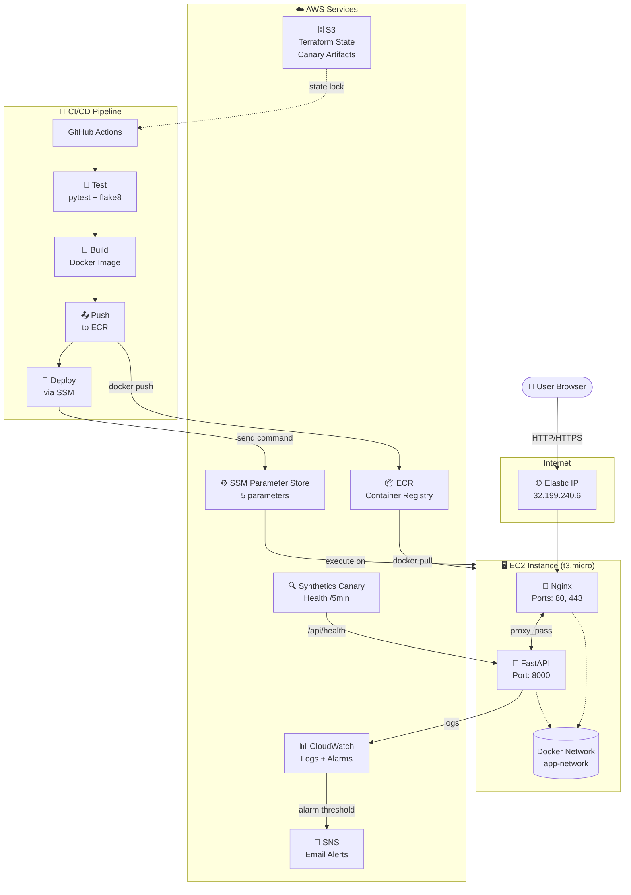

# 🏗️ Architecture — Pacman AI on AWS

## System Overview



## Component Details

### 🖥️ EC2 Instance

| Property | Value |
|----------|-------|
| Instance Type | t3.micro (free tier) |
| AMI | Amazon Linux 2023 |
| Region | us-east-1 |
| Elastic IP | 32.199.240.6 |
| IAM Role | pacman-game-ec2-role |
| SSM Agent | Running (managed) |

**Installed Software:**
- Docker Engine
- Docker Compose v5 (standalone binary)
- CloudWatch Agent
- Amazon SSM Agent

### 🔀 Nginx (Sidecar Container)

| Property | Value |
|----------|-------|
| Image | nginx:alpine |
| Ports | 80 (HTTP), 443 (HTTPS) |
| Config | nginx/nginx.conf |
| Volumes | certbot-webroot, certbot-conf |

**Responsibilities:**
- Reverse proxy to backend container
- TLS termination (once configured)
- Gzip compression
- WebSocket upgrade headers
- Static file serving

### 🐍 FastAPI Backend

| Property | Value |
|----------|-------|
| Image | Built from Dockerfile |
| Port | 8000 (internal only) |
| Framework | FastAPI + Uvicorn |
| Health Check | `/api/health` |

**Key Features:**
- REST API for AI algorithms
- Real-time maze solving
- Game state management
- CORS enabled

### 🔒 Certbot (Sidecar Container)

| Property | Value |
|----------|-------|
| Image | certbot/certbot |
| Schedule | Every 12 hours |
| Certificates | Let's Encrypt |
| Domain | (pending configuration) |

---

## Security Architecture

```
Internet ──[Port 80/443]──► Nginx ──[Docker Network]──► Backend
                                    │
                                    └── Port 8000 NOT exposed to internet

SSH Access: Disabled (use SSM instead)
Secrets: SSM Parameter Store (not hardcoded)
IAM: Least-privilege role attached to EC2
```

### Network Rules (Security Group)

| Port | Protocol | Source | Purpose |
|------|----------|--------|---------|
| 80 | TCP | 0.0.0.0/0 | HTTP (Nginx) |
| 443 | TCP | 0.0.0.0/0 | HTTPS (Nginx) |
| 8000 | TCP | 0.0.0.0/0 | Backend (direct, temporary) |
| 22 | TCP | 0.0.0.0/0 | SSH (bootstrap only) |

### IAM Role Permissions

```
pacman-game-ec2-role
├── AmazonSSMManagedInstanceCore     # SSM access
├── AmazonEC2ContainerRegistryReadOnly # ECR pull
├── CloudWatchAgentServerPolicy      # CloudWatch logs/metrics
└── Custom: SSM Parameter Access     # Read/write /pacman/* params
```

---

## Monitoring Architecture

```
┌─────────────────────────────────────────────────────────┐
│                    CloudWatch                            │
│                                                          │
│  ┌─────────────┐  ┌─────────────┐  ┌─────────────┐     │
│  │ Log Group    │  │ CPU Alarm   │  │ Health      │     │
│  │ /pacman-game │  │ >80% CPU    │  │ Canary      │     │
│  │ /application │  │ 5 min       │  │ /5 min      │     │
│  └──────┬──────┘  └──────┬──────┘  └──────┬──────┘     │
│         │                │                │              │
│         └────────────────┼────────────────┘              │
│                          ▼                               │
│                    ┌──────────┐                          │
│                    │   SNS    │                          │
│                    │  Topic   │                          │
│                    └────┬─────┘                          │
│                         │                                │
│                    ┌────▼─────┐                          │
│                    │  Email   │                          │
│                    │ Notification│                        │
│                    └──────────┘                          │
└─────────────────────────────────────────────────────────┘
```

### Log Sources

| Source | Destination | Retention |
|--------|-------------|-----------|
| Backend stdout/stderr | CloudWatch `/pacman-game/application` | 30 days |
| Nginx access/error | Container logs | Docker logs |
| Deploy events | `/var/log/deploy.log` on EC2 | Permanent |

### Alarm Configuration

| Alarm | Metric | Threshold | Period | Action |
|-------|--------|-----------|--------|--------|
| CPU High | CPUUtilization | >80% | 5 min | SNS → Email |
| Health Failures | Log metric filter | >5 errors | 5 min | SNS → Email |

---

## CI/CD Pipeline Details

### Trigger

```yaml
on:
  push:
    branches: [main]
  workflow_dispatch:  # Manual trigger
```

### Job 1: Test

```
┌──────────────────────────────────────┐
│  🧪 Test Job                         │
│                                      │
│  1. Checkout code                    │
│  2. Setup Python 3.11                │
│  3. Create virtual environment       │
│  4. Install pytest + flake8 + deps   │
│  5. Run pytest (8 tests)             │
│  6. Run flake8 linter                │
│                                      │
│  Duration: ~30 seconds               │
│  Runner: ubuntu-latest               │
└──────────────────────────────────────┘
```

### Job 2: Build & Push to ECR

```
┌──────────────────────────────────────┐
│  🐳 Build Job                        │
│                                      │
│  1. Checkout code                    │
│  2. Configure AWS credentials        │
│  3. Login to ECR                     │
│  4. docker build -t :${SHA}          │
│  5. docker tag for ECR               │
│  6. docker push to ECR               │
│                                      │
│  Image: pacman-game:${GIT_SHA}       │
│  Duration: ~2 minutes                │
│  Runner: ubuntu-latest               │
└──────────────────────────────────────┘
```

### Job 3: Deploy to EC2

```
┌──────────────────────────────────────┐
│  🚀 Deploy Job                       │
│                                      │
│  1. Checkout code                    │
│  2. Configure AWS credentials        │
│  3. Get ECR repository URI           │
│  4. Send SSM command to EC2:         │
│     a. Download deploy.sh via curl   │
│     b. Pull new Docker image         │
│     c. Stop old container            │
│     d. Start new container           │
│     e. Health check (10 retries)     │
│     f. Rollback on failure           │
│                                      │
│  Duration: ~2 minutes                │
│  Runner: ubuntu-latest               │
└──────────────────────────────────────┘
```

---

## Terraform Resources

### Resource Map

```
terraform/
├── main.tf               # S3 backend, provider config
├── ec2.tf                # EC2 instance + Elastic IP
├── ecr.tf                # ECR repository + lifecycle policy
├── iam.tf                # IAM role + policies
├── security_groups.tf    # Security group rules
├── cloudwatch.tf         # Log group, alarms, canary
├── ssm.tf                # 5 SSM parameters
├── network.tf            # VPC/subnet data sources
├── variables.tf          # Input variables
└── outputs.tf            # Exported values
```

### State Management

| Property | Value |
|----------|-------|
| Backend | S3 |
| Bucket | `pacman-tf-state-211125530162` |
| Lock Table | `terraform-locks` |
| Region | us-east-1 |

---

## Cost Optimization

### Design Decisions

| Decision | Cost Saved | Trade-off |
|----------|-----------|-----------|
| Nginx sidecar vs ALB | ~$16-18/mo | Manual TLS management |
| t3.micro vs t3.small | ~$7/mo | Less CPU/memory |
| No NAT Gateway | ~$32/mo | No private subnets |
| SSM vs SSH | $0 | Different access model |

### Free Tier Usage

| Service | Free Tier | Our Usage |
|---------|-----------|-----------|
| EC2 | 750 hrs/mo | ~730 hrs (1 instance) |
| EBS | 30 GB/mo | 20 GB |
| ECR | 500 MB | <100 MB |
| CloudWatch | 5 GB/mo | <1 GB |
| SSM | 10K params | 5 params |
| SNS | 1M publishes | <1K |

---

*Architecture designed for minimal cost while maintaining production-grade reliability.*
